# surfs_up
Advanced Data Storage and Retrieval utilizing Jupyter Notebook and VS Code, along with
Flask web framework, the SQLAlchemy querying tool, and a SQLite local database. 

## Project Outline
This report contains project background and development information; analysis findings and summary recommendations; and a listing of coding notes and resources.

### Background
An opportunity to follow a dream -- running a combo "Surf / Ice Cream Shop" on the
beautiful Hawaiian island of Oahu -- with an investor "W. Avy," requires an analysis
of the local weather to determine feasibility and year-round sustainability of the
business. For the challenge, W.Avy has asked for temperature trends, specifically for
the months of June and December in Oahu.

### Development (#)
(#) *The Coding Notes section (below on the page) describes a method for becoming familiar with data presented in the SQLite database file `hawaii.sqlite`.*

In order that W. Avy and other potential investors may view underlying data for the analysis, a "Climate Analysis API" website application is developedImage A. with four "routes" (identified by text that is appended to the webpage home address):
1. rain level readingsImage A1.: `/api/v1.0/precipitation`
2. recording stationsImage A2.: `/api/v1.0/stations`
3. temperature observationsImage A3.: `/api/v1.0/tobs`
4. interactive temperature statistics by dateImage A4.; note 1.: `/api/v1.0/temp/start/end`

>Image A. Climate Analysis API "Homepage":
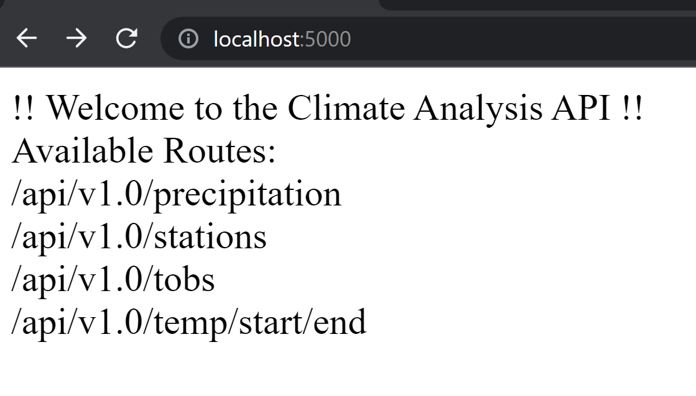
>Image A1. Precipitation Route:
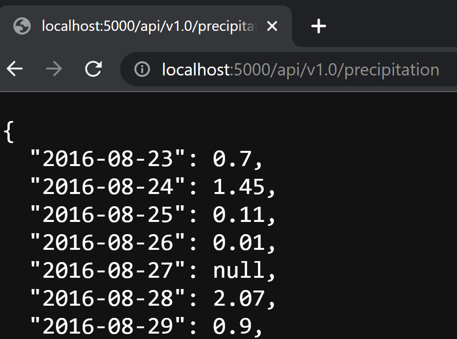
 Image A2. Stations Route:
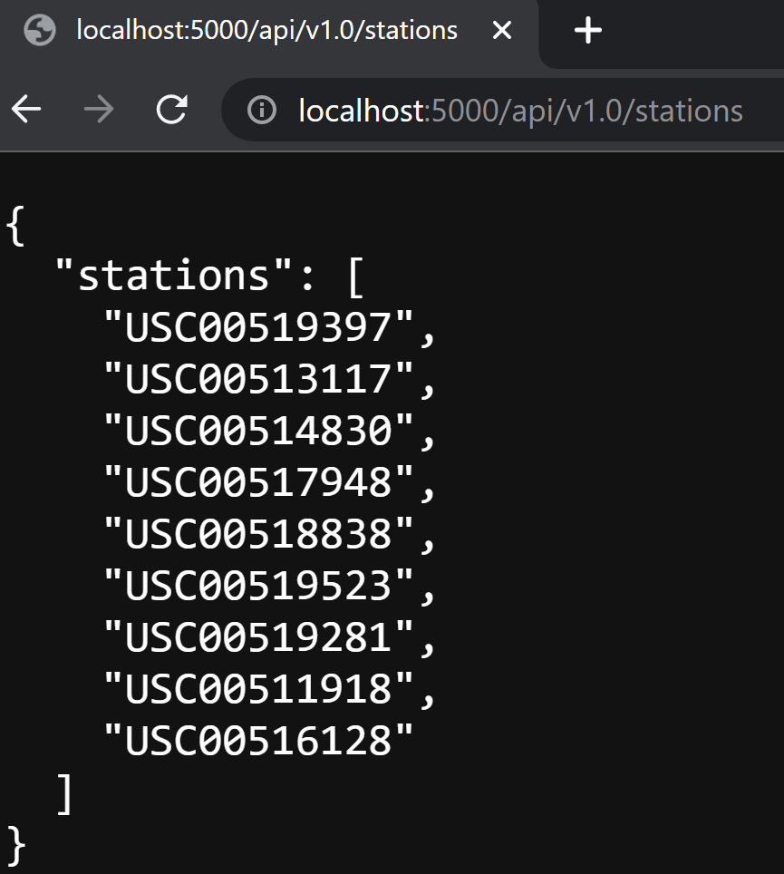
 Image A3. Temperature Route:
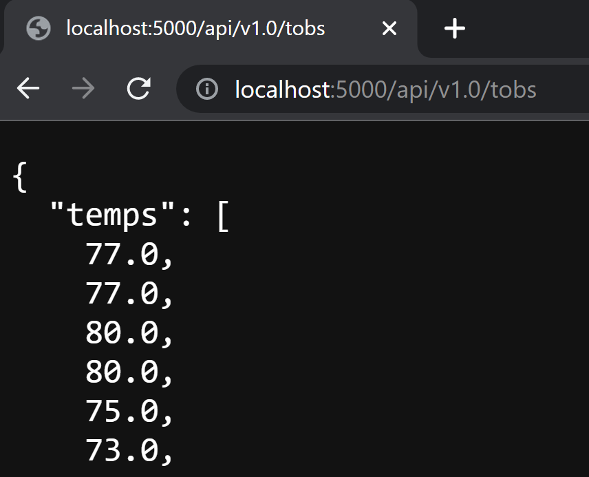
 Image A4. Statistics Route (month of June 2017):
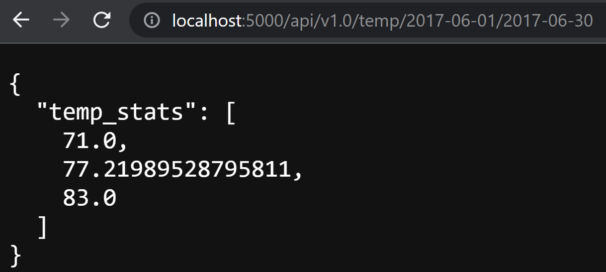 
>>note 1.Dates are input in format 'yyyy-mm-dd', with a corresponding lookup and output of minimum, average, and maximum temperatures for that date (range).

## Analysis Overview
As introduced in the Project Outline above, this section is comprised of results and a summary of additional recommendations.

### Results
The tableTable A. below summarizes the results depicted in Image B1 and Image B2, which show, respectively, June and December temperature statistics.

Table A.:

|Statistical Measurement|June Temps Value|December Temps Value|Remarks|
|---|---|---|---|
|count|1700.000000|1517.000000|• About 6 more readings/day average in June than December, as calculated from: [(1700-1517)/30 or 31 days = 6.1 or 5.9]|
|||||
|mean|74.944118|71.041529|• Average temperature in the mid-seventies in June vs. low-seventies in December, based on [historical temperature values].|
|||||
|std|3.257417|3.745920|• Similar spread of values if normal data sets [std about half a degree differencei].|
|||||
|min|64.000000|56.000000|• Both June and December min temps :weak: (not strong) outliers.ii [:more than 1.5xIQR: (but less than 3.0xIQR) **below** 25% value]|
|||||
|25%|73.000000|69.000000||
|50%|75.000000|71.000000||
|75%|77.000000|74.000000||
|max|85.000000|83.000000|• Both June and December max temps :weak: (not strong) outliers.ii [:more than 1.5xIQR: (but less than 3.0xIQR) **above** 75% value]|
|||||

isee discussion 'empirical rule' at:  https: //en.wikipedia.org/wiki/68%E2%80%9395%E2%80%9399.7_rule ( https: //en.wikipedia.org/wiki/68–95–99.7_rule )
 iisee discussion of outliers at: https: //www.thoughtco.com/what-is-an-outlier-3126227

>Image B1. June temperature statistics:
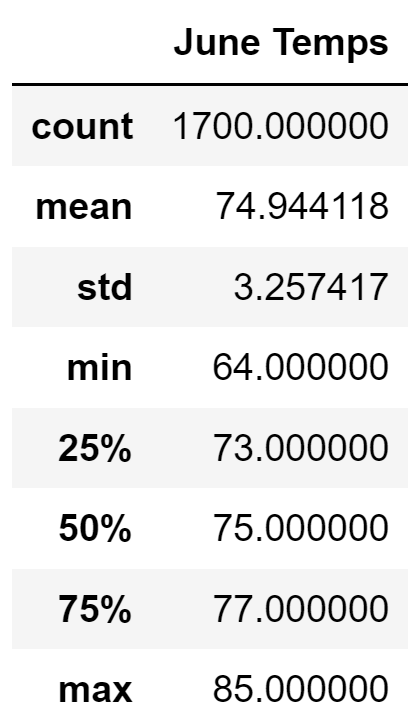
 Image B2. December temperature statistics:
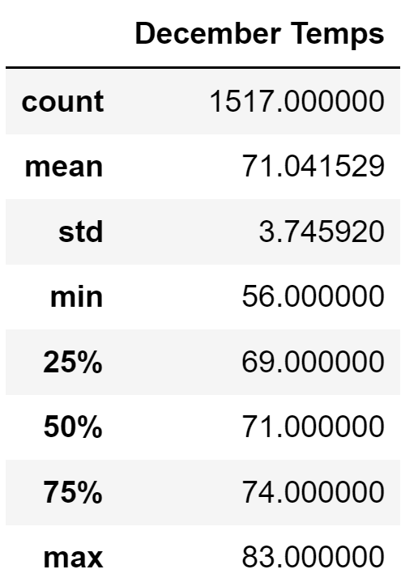

### Summary
With data showing average temperatures in the beginning of winter (December) near the same range of temperatures at the start of summer in the month of June, the initial inspection would indicate that the Surf/Ice Cream shop could be sustainably opened year-round near the data gathering station locales.

Further analysis would include looking into specific location, including elevation of the stations recording outlier--in particular the low outlier--temperatures in order to check for potential links for lower temperatures being achieved. The query for checking stations with low outlier temperatures (as determined by the December Temps readings from Image B2 above), is listed below in Image C1, which also lists the first few rows of results from the query.
> Image C1. An additional query - check stations select low temperature readings (underlined in orange, the ? = 61.5° - as discussed in `SurfsUp_Challenge.ipynb` file, this temperature used as it is `December Temps` low outlier value):
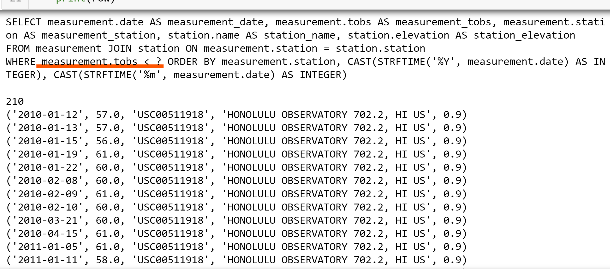

Scrolling the query results, of note is that all nine of the Weather Stations are listed that record results from in the `hawaii.sqlite` file. Hence, it appears station elevation *is not* a factor related to or causing lower temperature readings. However, by scrolling the results fully and making note of the dates there, it does appear that the lower readings are related to month when the reading was taken -- all the lower temperature readings (ones below 61.5°) occur between the months of November through April (**no temperatures** in the file recorded during the months from May through October were lower than 61.5°). This can be a bit of good news whereby it may be useful in devising seasonal promotions for months where the lower temperatures occur -- e.g., featuring sales for surfing bodysuits during chillier-temperature months, or offering a selection of warmer café-style drinks in addition to ice cream at those times.

And for a second (final) additional query, rainfall (precipitation) recordings for a specific timeframe can be reviewed *for each weather recording station*. An emphasis is made that each station must be considered individually, since note here that at first, a method was considered to query considering only precipitation without regard to stations; but this approach actually makes little sense for purposes here as the the precitation totals would be elevated--essentially collecting multiple spread out location numbers not into a correspondingly larger bucket, but into one the size for an individual station--with the resulting potential to make the days appear rainier than reality; i.e., two inches rain in 5 different locations is still two inches in each location, *not* a total of 10 (two\*5). Trying to make a comparison (though admittedly maybe somewhat flawed and unclear the connection), this original approach might perhaps be compared to e.g., to taking the overall rainfall values occurring throughout the United States for a given timeframe, and attributing a sum of all those values to a regional storm from a single state. But to quit the digression and present the sample query, with a summary listing results for the month of June 2017 (June for most recent year in the `hawaii.sqlite` file), Image C2 is below...
> Image C2.  Summary level precipitation - seven stations recording precipitation in June 2017:
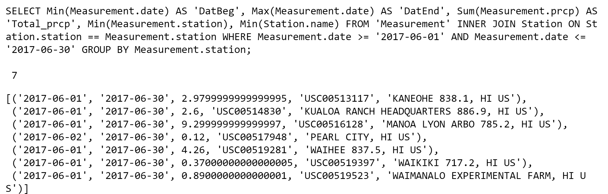

---
#### Coding Notes
- Once it is read in, throughout Module 9 material, the `hawaii.sqlite` file is connected (a linked session is established to it through SQLAlchemy dependencies) for data access, and can thus be 'inspected' (utilizing an import of SQLAlchemy inspect dependency) to become familiar with the structure (tables and corresponding columns) available. The images below depict set-up code for the method and results obtained via this method:

>Notes Image. Additional steps to set-up inspector for SQLAlchemy
>>- the import code is to be added to the import Dependencies section at top of Jupyter Notebook;
>>- then the next line is to be coded after engine created, Base reflected, and session linked:
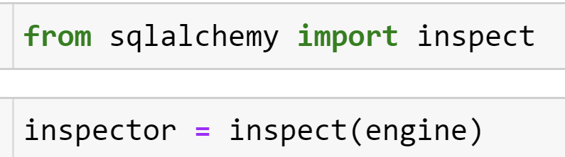
> Notes Image 1. Columns of `Measurement` table:
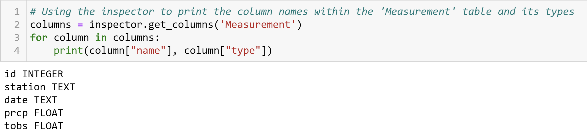
> Notes Image 2. Columns of `Station` table:
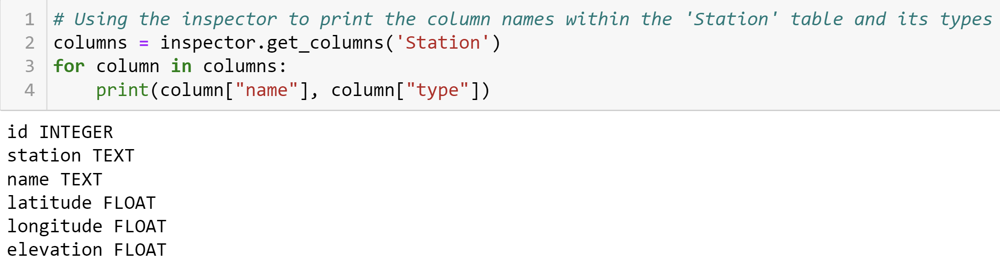

#### Sources / Resources
This is a (re)source summary; non-course websites are noted with code in the Deliverable file (plus the two listed above in notes below Table A).
- Module 9 activity files from Data Bootcamp instruction classes.
- Challenge starter code file (SurfsUp_Challenge_starter_code.ipynb).
- Google web search to look up the following:
> - description for imported Pandas dependency (found on mode.com)
> - example utilizing extract function imported from SQLAlchemy (found on stackoverflow.com)
- SQLAlchemy 1.4 Documentation
- TA & Pre-class Office Hours; Class Breakout rooms (issues for proper Flask and environment installation; and development website error messages encountered in prior Module)
